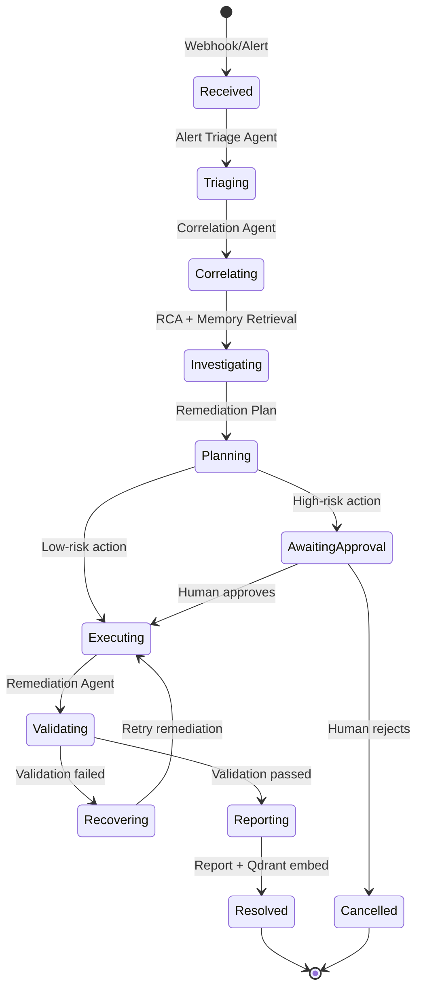
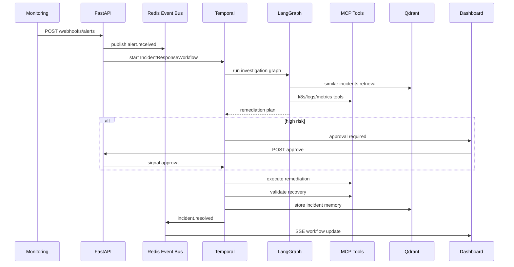

# Incident Workflow Lifecycle

```mermaid
stateDiagram-v2
    [*] --> Received: Webhook/Alert
    Received --> Triaging: Alert Triage Agent
    Triaging --> Correlating: Correlation Agent
    Correlating --> Investigating: RCA + Memory Retrieval
    Investigating --> Planning: Remediation Plan
    Planning --> AwaitingApproval: High-risk action
    Planning --> Executing: Low-risk action
    AwaitingApproval --> Executing: Human approves
    AwaitingApproval --> Cancelled: Human rejects
    Executing --> Validating: Remediation Agent
    Validating --> Recovering: Validation failed
    Recovering --> Executing: Retry remediation
    Validating --> Reporting: Validation passed
    Reporting --> Resolved: Report + Qdrant embed
    Resolved --> [*]
    Cancelled --> [*]
```

## Sequence: Alert to Resolution

```mermaid
sequenceDiagram
    participant M as Monitoring
    participant API as FastAPI
    participant EB as Redis Event Bus
    participant T as Temporal
    participant LG as LangGraph
    participant MCP as MCP Tools
    participant Q as Qdrant
    participant UI as Dashboard

    M->>API: POST /webhooks/alerts
    API->>EB: publish alert.received
    API->>T: start IncidentResponseWorkflow
    T->>LG: run investigation graph
    LG->>Q: similar incidents retrieval
    LG->>MCP: k8s/logs/metrics tools
    LG-->>T: remediation plan
    alt high risk
        T->>UI: approval required
        UI->>API: POST approve
        API->>T: signal approval
    end
    T->>MCP: execute remediation
    T->>MCP: validate recovery
    T->>Q: store incident memory
    T->>EB: incident.resolved
    EB->>UI: SSE workflow update
```
